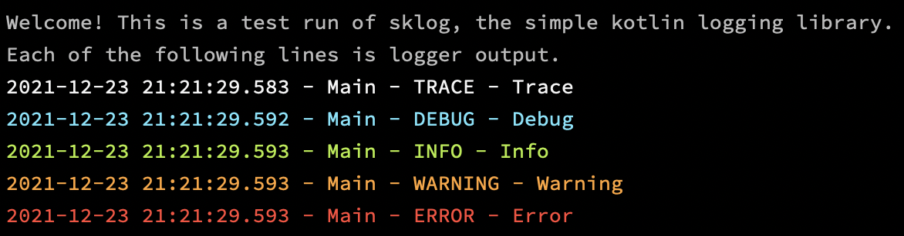

sklog - simple Kotlin logging
=============================

Kotlin (JVM) logging library for printing colorized text to the console, with an easy upgrade path to the
popular [kotlin-logging library]


Rationale
---------
Logging is a necessary part of most projects, but setting it up can be a chore.

Java has several popular logging frameworks, as well as the
built-in [java.util.logging](https://docs.oracle.com/javase/8/docs/technotes/guides/logging/overview.html), but all come
with their own [issues](https://logging.apache.org/log4j/2.x/security.html).

For Kotlin, the [kotlin-logging library] has become relatively popular, but it's not a standalone logger. Instead, it
acts as a wrapper around [SLF4J](https://www.slf4j.org/), which is itself a logging "facade" (i.e., frontend), meaning
that it requires a separate backend/implementation to work.

As a result, even if all you want to do is print log output to the console (`System.err`), you'll need to pull in three
separate dependencies: kotlin-logging, SLF4J, and SLF4J's _[Simple](https://www.slf4j.org/manual.html#swapping)_
implementation. That can be a lot, especially for smaller projects with relatively simple logging needs.

It can also be difficult to figure out how to configure these libraries, for example if you want to change the log level so that you actually see debug messages.

This library exists to make it easy to start logging, without worrying about dependencies and complex configuration.


Features
--------

- No dependencies, other than the Kotlin language and the Java standard library
    - [The entire library is one file](sklog/src/main/kotlin/sklog/KotlinLogging.kt), which you can copy directly into
      your project!
- Messages are printed to `System.err`
- Output includes timestamp and the name of the class where the logger was declared
    - Possible to set custom logger names
- Output colorized based on log level
    - But this can be disabled
- Log level can be customized
- No other customizations are available in this library
- But it's **really easy to upgrade to a more full-featured solution**, the _[kotlin-logging library]_! (see below)

Example & usage
---------------



This screenshot was generated by the following program:

```kotlin
import sklog.KotlinLogging
import sklog.LogLevel

private val logger = KotlinLogging.logger {}

fun main() {
    // The default log level is DEBUG,
    // but it can be set to TRACE globally or on a per-logger basis
    logger.logLevel = LogLevel.TRACE

    println("Welcome! This is a test run of sklog, the simple kotlin logging library.")
    println("Each of the following lines is logger output.")

    logger.trace { "Trace" }
    logger.debug { "Debug" }
    logger.info { "Info" }
    logger.warning("Warning")
    logger.error("Error")
}
```

Using this library
------------------
This library is made available via [JitPack](https://jitpack.io/). Here's how you can add it to your project:

### Gradle (`build.gradle.kts`)

```kotlin
repositories {
    maven {
        url = uri("https://jitpack.io")

        // You can ensure that only this library is loaded from JitPack, and nothing else, using "repository content filtering": https://docs.gradle.org/current/userguide/declaring_repositories.html#sec:repository-content-filtering
        content {
            includeGroup("com.github.nmalkin")
        }
    }
}

dependencies {
    implementation("com.github.nmalkin:sklog:0.0.2")
}
```

### Gradle (`build.gradle`)

```gradle
repositories {
    maven {
        url 'https://jitpack.io'

        // You can ensure that only this library is loaded from JitPack, and nothing else, using "repository content filtering": https://docs.gradle.org/current/userguide/declaring_repositories.html#sec:repository-content-filtering
        content {
            includeGroup 'com.github.nmalkin'
        }
    }
}

dependencies {
    implementation 'com.github.nmalkin:sklog:0.0.2'
}
```

### Maven
```xml
<repositories>
  <repository>
    <id>jitpack.io</id>
    <url>https://jitpack.io</url>
  </repository>
</repositories>

<dependency>
  <groupId>com.github.nmalkin</groupId>
  <artifactId>sklog</artifactId>
  <version>0.0.2</version>
</dependency>
```

Upgrade path
------------
If you start using this library and realize you need more features, upgrading to the [kotlin-logging library] should be
very easy!
This library's API was based on kotlin-logging and designed to be compatible. In particular:

- Loggers are declared the same way
  ```kotlin
  private val logger = KotlinLogging.logger {}
  ```
- Messages can be logged as lambdas (so they don't get evaluated if the log level is disabled)
  ```kotlin
  logger.debug { "Some $expensive message!" }
  ```

Because of this, upgrading to kotlin-logging might be as simple as swapping our your imports:

```diff
< import sklog.KotlinLogging
---
> import mu.KotlinLogging
```

[kotlin-logging library]: https://github.com/MicroUtils/kotlin-logging
